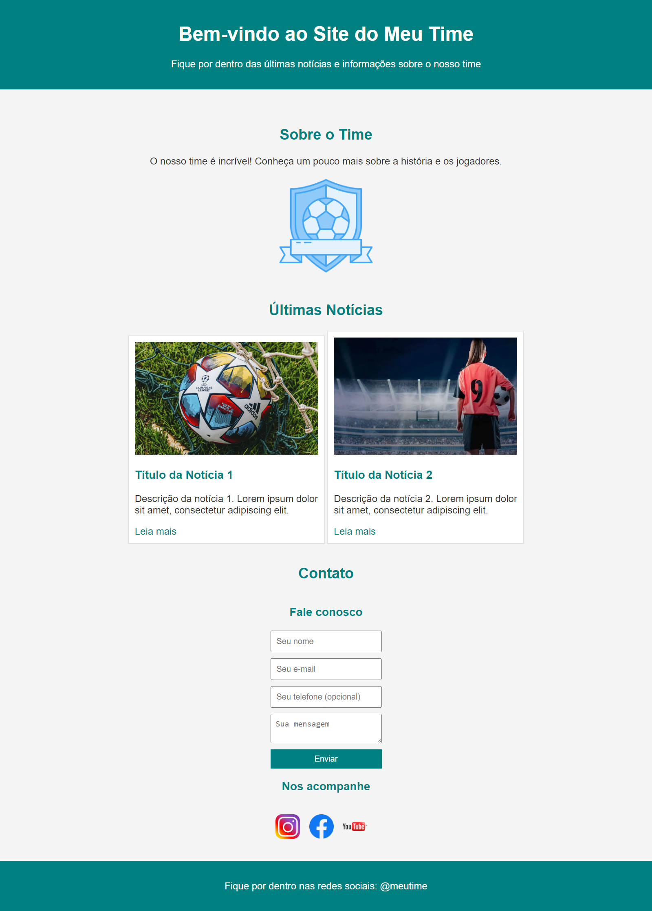

<h1 align="center">Site de Futebol Feminino</h1>

    
  

## Estrutura do Código

O código HTML está estruturado em seções como "Sobre o Time", "Últimas Notícias" e "Contato".
O CSS fornece estilos para tornar a página visualmente atraente e responsiva.

## Tecnologias Utilizadas
HTML5

CSS3

## Personalização
Sinta-se à vontade para personalizar o conteúdo, as cores e os estilos conforme as necessidades do seu projeto. Adicione novas seções, atualize as imagens e faça ajustes de acordo com as preferências.

## Contribuições
Contribuições são bem-vindas! Sinta-se à vontade para abrir uma issue ou enviar um pull request para melhorar este projeto.

 
<h2 align="center"> Desenvolvido por:
</h2>

<h3 align="center"> Renata Ribeiro 

</h3>
  
